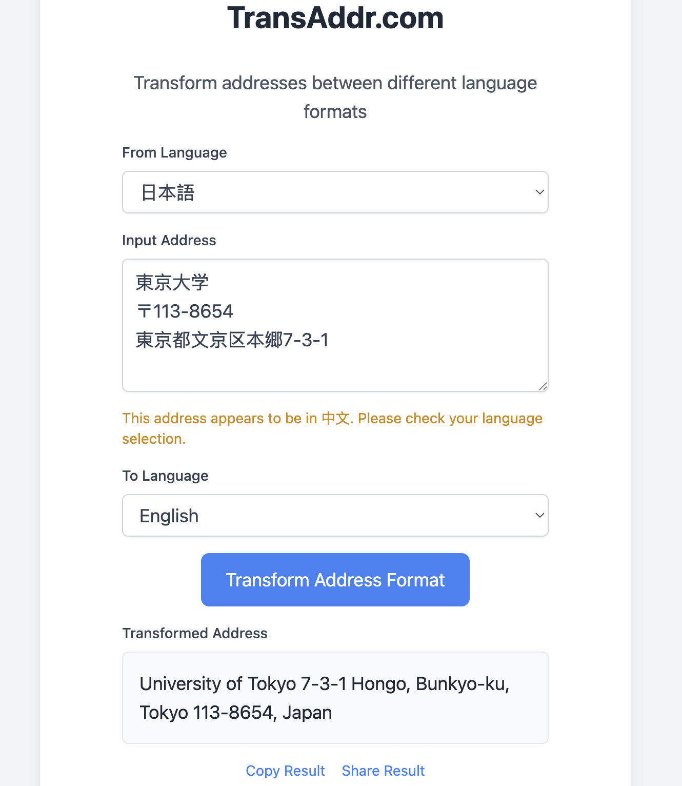

# TransAddr - Address Format Transformer

A web application that transforms addresses between different language formats using AI technology.




## Features

- Support multiple languages (English, Chinese, Japanese, Korean)
- Real-time language detection
- AI-powered address format transformation
- Copy and share functionality
- Clean and responsive UI

## Tech Stack

- Vue 3 + Vite
- Tailwind CSS
- ZhipuAI GLM-4 API
- Axios for API calls

## Project Setup

```bash
# Install dependencies
npm install

# Start development server
npm run dev

# Build for production
npm run build
```

## Environment Variables

Create a `.env` file in the project root:

```env
VITE_ZHIPU_API_KEY=your_zhipu_api_key_here
```

## Project Structure

```
trans_addr/
├── docs/                 # Project documentation
│   ├── design.md        # Design documentation
│   ├── tech_options.md  # Technology choices
│   └── process.md       # Development process
├── src/
│   ├── components/      # Vue components
│   ├── services/        # API services
│   └── assets/         # Static assets
├── public/              # Public static files
└── ...
```

## Development

1. Clone the repository
2. Install dependencies: `npm install`
3. Set up environment variables
4. Start development server: `npm run dev`

## Deployment

This project is configured for deployment on Vercel:

1. Push code to GitHub
2. Import project in Vercel
3. Set environment variables
4. Deploy

## Documentation

- Design documentation: [docs/design.md](docs/design.md)
- Technical choices: [docs/tech_options.md](docs/tech_options.md)
- Development process: [docs/process.md](docs/process.md)

## License

MIT 